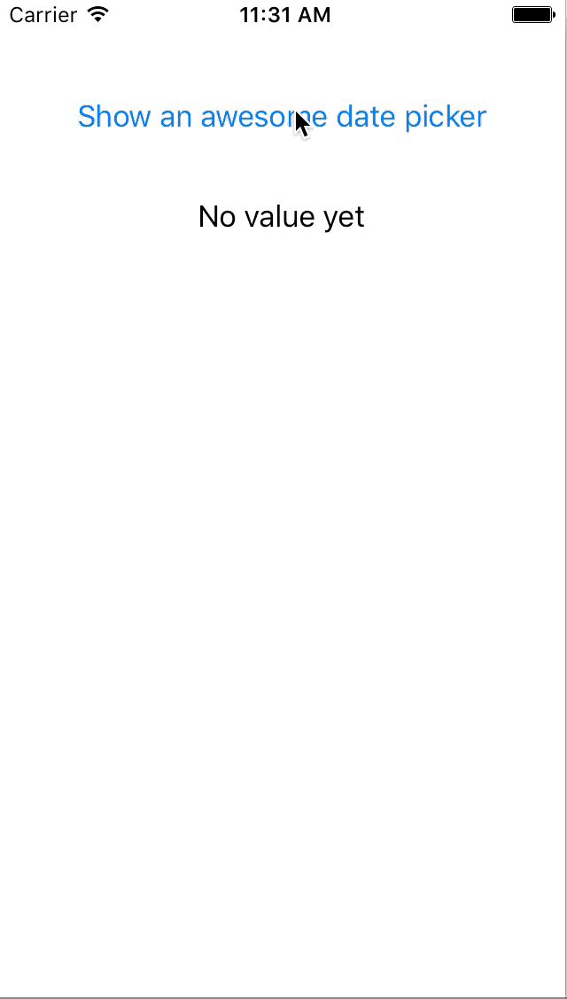

# MIDatePicker
A lightweight, non-invasive, fully customizable DatePicker

# Setup
- Copy the "MIDatePicker" folder to your project.
- Create a new instance with just a line of code
```
  datePicker = MIDatePicker.getFromNib()
```

- Set the delegate and edit the MIDatePicker.Config struct to customize the date picker's UI and behavior
```
  datePicker.delegate = self
  
  datePicker.config.startDate = NSDate()

  datePicker.config.animationDuration = 0.25

  datePicker.config.cancelButtonTitle = "Cancel"
  datePicker.config.confirmButtonTitle = "Confirm"
  
  datePicker.config.contentBackgroundColor = UIColor(red: 253/255.0, green: 253/255.0, blue: 253/255.0, alpha: 1)
  datePicker.config.headerBackgroundColor = UIColor(red: 244/255.0, green: 244/255.0, blue: 244/255.0, alpha: 1)
  datePicker.config.confirmButtonColor = UIColor(red: 32/255.0, green: 146/255.0, blue: 227/255.0, alpha: 1)
  datePicker.config.cancelButtonColor = UIColor(red: 32/255.0, green: 146/255.0, blue: 227/255.0, alpha: 1)
```

- Use the delegate's methods to interact with your view controller
```
  func miDatePicker(amDatePicker: MIDatePicker, didSelect date: NSDate) {
    // Do something when the user has confirmed a selected date
  }
  func miDatePickerDidCancelSelection(amDatePicker: MIDatePicker) {
    // Do something then user tapped the cancel button
  }
```


# Demo
In this repository you can also find a demo.



# Info
If you like this git you can follow me here or on twitter :) [@MarioIannotta](http://www.twitter.com/marioiannotta)

Cheers from Italy!
